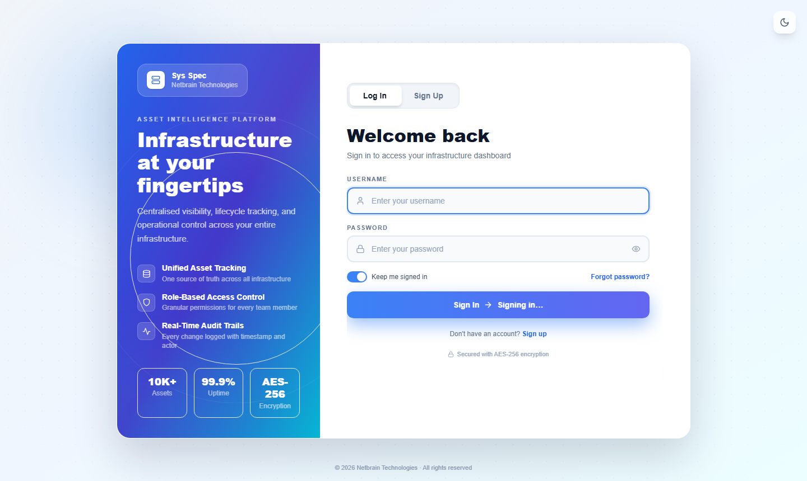
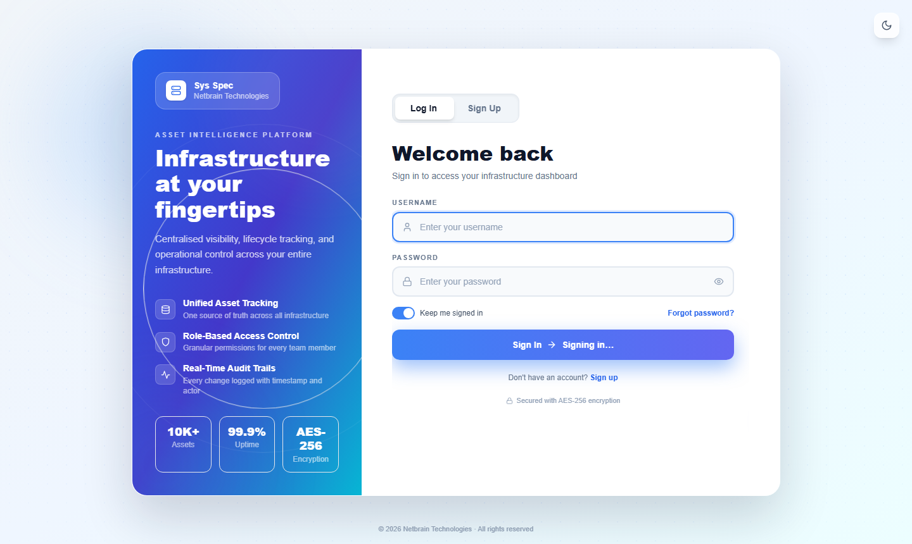

# Standard Operating Procedure (SOP)
# Asset Inventory Management Tool

---

| Document Details | |
|---|---|
| **Document Title** | Asset Inventory Tool – Standard Operating Procedure |
| **Version** | 1.0 |
| **Audience** | All Team Members |
| **Last Updated** | April 2026 |

---

## Table of Contents

1. [Overview](#1-overview)
2. [User Roles & Permissions](#2-user-roles--permissions)
3. [Getting Started – Login](#3-getting-started--login)
4. [Navigation Layout](#4-navigation-layout)
5. [Dashboard](#5-dashboard)
6. [Asset List (Main Inventory)](#6-asset-list-main-inventory)
7. [Extended Asset List](#7-extended-asset-list)
8. [Beijing Asset List](#8-beijing-asset-list)
9. [Physical Assets](#9-physical-assets)
10. [Excel Smart Import](#10-excel-smart-import)
11. [Report Builder](#11-report-builder)
12. [Configuration (Dropdown Management)](#12-configuration-dropdown-management)
13. [Custom Fields](#13-custom-fields)
14. [User Management](#14-user-management)
15. [Branding & Customization](#15-branding--customization)
16. [Backup & Export](#16-backup--export)
17. [Email Notifications](#17-email-notifications)
18. [Audit Explorer](#18-audit-explorer)
19. [Deleted Items](#19-deleted-items)
20. [My Profile](#20-my-profile)
21. [Quick Reference – Common Tasks](#21-quick-reference--common-tasks)

---

## 1. Overview

The **Asset Inventory Management Tool** is a centralised web application for tracking, managing, and reporting on all IT assets across the organisation. It provides a single source of truth for:

- **Server and VM inventory** (Asset List)
- **Non-standard and extended assets** (Extended Asset List)
- **Beijing region assets** (Beijing Asset List)
- **Physical hardware inventory** (Physical Assets)
- **Bulk import from Excel/CSV**
- **Audit trails, reporting, and notifications**

All data is stored in a PostgreSQL database and accessible through a browser-based interface — no software installation is required on end-user machines.

---

## 2. User Roles & Permissions

There are three user roles. Your role determines what you can see and do in the tool.

| Feature | Admin | ReadWrite | ReadOnly |
|---|:---:|:---:|:---:|
| View all asset lists | ✅ | ✅ | ✅ |
| Add / Edit assets | ✅ | ✅ | ❌ |
| Delete assets | ✅ | ✅ | ❌ |
| Import assets (Excel/VMware) | ✅ | ❌ | ❌ |
| Export CSV | ✅ | ✅ | ✅ |
| View Dashboard | ✅ | ✅ | ✅ |
| Report Builder | ✅ | ✅ | ✅ |
| Configuration (dropdowns) | ✅ | ✅ | View only |
| Custom Fields management | ✅ | ❌ | ❌ |
| User Management | ✅ | ❌ | ❌ |
| Branding | ✅ | ❌ | ❌ |
| Backup & Export | ✅ | ❌ | ❌ |
| Email Notifications | ✅ | ❌ | ❌ |
| Audit Explorer | ✅ (if enabled) | ❌ | ❌ |
| Deleted Items (Restore) | ✅ | ❌ | ❌ |
| View stored passwords | ✅ (if granted) | ✅ (if granted) | ❌ |

> **Note:** Individual page access can be further restricted by an Admin via the Password & Page Control settings.

---

## 3. Getting Started – Login

### 3.1 Logging In

1. Open your browser and go to the tool's URL (provided by your IT Administrator).
2. Enter your **Username** and **Password**.
3. Click **Login**.

### 3.2 Forgotten Password

Contact your system Administrator to reset your password. Admins can reset passwords from the **User Management** page.

### 3.3 Logging Out

Click your **profile avatar** (top-right corner) and select **Logout**.

---

## 4. Navigation Layout

After logging in, you will see the main layout:

| Area | Description |
|---|---|
| **Left Sidebar** | Main navigation menu with links to all sections |
| **Top Bar** | Application name/logo, dark mode toggle, profile avatar |
| **Main Content Area** | The active page content |

### Sidebar Sections

The sidebar is grouped into the following sections:

- **Main** — Dashboard, Asset List, Extended Asset List, Physical Assets, Beijing Asset List
- **Import / Reports** — New Asset Import, Excel Smart Import, Import Audit Report, Report Builder, Tenable Report/Import
- **Settings** — Configuration, Custom Fields, User Management, Branding, Backup, Email Notifications, Audit Explorer, Deleted Items
- **My Account** — Profile

---

## 5. Dashboard

**Route:** `/dashboard` | **Access:** All users

The Dashboard is your home screen after logging in. It provides a live summary of the asset inventory.

### 5.1 Tabs

| Tab | What It Shows |
|---|---|
| **Executive Overview** | Health score, total assets, alive servers, unmanaged count, onboard pending |
| **Asset Inventory** | VM count, physical servers, ME/Tenable agent stats, patching breakdown |
| **Extended Inventory** | Extended asset totals, active/inactive, agent status |
| **Weekly Report** | Historical trend charts over the past weeks |

### 5.2 KPI Cards

Each card shows a metric (e.g., Total Assets, ME Installed, Auto Patch). Click any card to navigate directly to the relevant filtered list.

### 5.3 Charts

- **Dept-wise Endpoint Distribution** — Pie chart showing assets per department
- **Patching Compliance** — Breakdown of patching types
- **Location-wise Patching** — Bar chart showing patching status per location

### 5.4 Refreshing Data

The dashboard auto-refreshes based on the configured interval. Click the **Refresh** icon on any card to manually refresh that metric.

---

## 6. Asset List (Main Inventory)

**Route:** `/asset-list` | **Access:** All users (add/edit requires ReadWrite or Admin)

This is the primary inventory of all servers and virtual machines.

### 6.1 Viewing Assets (List Tab)

The list shows all assets in a paginated table with sticky columns for VM Name and IP Address.

**Available Columns** (toggle via the **Columns** button):
- VM Name, IP Address, Hostname, Asset Type, OS, OS Version
- Department, Location, Assigned User, Asset Tag, Serial Number
- Status, EOL, Patching Type, Patch Schedule
- ME Installed, Tenable Installed
- iDRAC, OME, Hosted IP
- Username, Password (permission-gated)
- Business Purpose, Additional Remarks
- Any configured Custom Fields

**To adjust visible columns:**
1. Click the **Columns** button in the toolbar (Eye icon).
2. Check or uncheck columns from the dropdown.

### 6.2 Searching and Filtering

Use the **filter bar** at the top of the list to narrow results:

| Filter | Description |
|---|---|
| **Search box** | Type to search by VM Name, Hostname, IP Address |
| **All Locations** | Filter by office/data centre location |
| **All Departments** | Filter by department |
| **All Statuses** | Filter by server status (Alive, Powered Off, etc.) |
| **All Types** | Filter by asset type (VM, Physical, etc.) |

### 6.3 Adding a New Asset

1. Click **Add Asset** (or switch to the **Add** tab).
2. Fill in the form sections:

| Section | Key Fields |
|---|---|
| **Basic Information** | VM Name, Hostname, IP Address *(required)*, Asset Type, OS, OS Version |
| **Ownership** | Assigned User, Department, Business Purpose, Asset Tag |
| **Status & Patching** | Server Status, Patching Type, Server Patch Type, Schedule, Location, EOL Status |
| **Agent Status** | ME Installed (toggle), Tenable Installed (toggle) |
| **Host Details** | Serial Number, iDRAC Enabled, iDRAC IP, OME Status, Hosted IP |
| **Credentials** | Asset Username, Asset Password |
| **Custom Fields** | Any additional fields defined by Admin |

3. **IP Address** is automatically checked for duplicates as you type. If the IP already exists, a warning message is shown and you cannot save.
4. Click **Save Asset** to create the record.

### 6.4 Editing an Asset

1. In the list, click the **pencil (Edit)** icon on the row you want to edit.
2. The row expands into an edit form inline.
3. Make your changes.
4. Click **Save** to apply, or **Cancel** to discard.

### 6.5 Deleting an Asset

1. Click the **trash (Delete)** icon on the asset row.
2. A confirmation dialog appears — type the asset name or click **Confirm**.
3. The asset is moved to **Deleted Items** (not permanently removed).

### 6.6 Exporting to CSV

Click **Export CSV** in the toolbar. The file downloads automatically with a timestamp in the filename.

### 6.7 Bulk Delete

*(Requires ReadWrite or Admin)*

1. Select multiple assets using the checkboxes on the left of each row.
2. The **Delete X** button appears in the toolbar.
3. Click it and confirm to bulk-delete selected assets.

### 6.8 Bulk Update

*(Requires Admin)*

1. Apply filters to target a group of assets.
2. Click **Bulk Update** in the toolbar.
3. Choose which fields to update (Department, Status, Patching, Location, EOL, Assigned User).
4. Use **Dry Run** first to preview how many assets will be affected.
5. Click **Apply Bulk Update** to execute.

---

## 7. Extended Asset List

**Route:** `/ext-asset-list` | **Access:** All users (add/edit requires ReadWrite or Admin)

Used for non-standard assets such as network switches, routers, cloud resources, appliances, and any device not in the main inventory.

The interface is **identical to the Asset List** with the following differences:

- Additional field: **Record Status** (Active / Inactive / Decommissioned / Maintenance)
- Additional field: **Description**
- Bulk Update includes a **Record Status** field

All actions (Add, Edit, Delete, Export, Bulk Update, Filters, Columns toggle) work the same as described in [Section 6](#6-asset-list-main-inventory).

---

## 8. Beijing Asset List

**Route:** `/beijing-asset-list` | **Access:** All users (add/edit requires Admin)

A dedicated inventory for the Beijing office/region assets.

### 8.1 Viewing Assets

The list behaves the same as the main Asset List — search, filter, column toggle, export, and pagination all work identically.

**Filter Bar:** Search | All Locations | All Departments | All Statuses | All Types

### 8.2 Adding a Beijing Asset *(Admin only)*

1. Switch to the **Add New Asset** tab.
2. Fill the form (same field groups as Asset List — Basic Information, Ownership, Status & EOL, Patching, Agent Status, Host Details, Credentials, Custom Fields).
3. **IP Address** is required and must be unique.
4. Click **Add Beijing Asset**.

### 8.3 Viewing Asset Details

Click the **eye (View)** icon on any row to open the full detail page for that asset.

On the detail page:
- All sections are displayed in read-only mode.
- Click **Edit** (top-right) to switch to edit mode.
- Make changes, then click **Save** or **Cancel**.

### 8.4 Editing Inline

Click the **pencil (Edit)** icon on a row in the list to edit inline (same as main Asset List).

### 8.5 Beijing Custom Fields *(Admin only)*

Admins can define additional custom fields specific to Beijing assets via **Settings → Beijing Asset Fields**.

---

## 9. Physical Assets

**Route:** `/physical-assets` and `/physical-server-list` | **Access:** All users

Used to register and manage the physical hardware details of servers.

### 9.1 Physical Server List

Shows all registered physical servers grouped by model. Columns include Model, Cores, RAM, Disk Count, Serial, Location, Rack Number.

Click any row to open the **Physical Asset Detail** page for that server.

### 9.2 Registering a Physical Asset

1. Go to **Physical Assets** in the sidebar.
2. Enter the **Hosted IP** of the server (or select from Asset List).
3. Fill in hardware details: Asset ID, Department, Location, Model, Cores, RAM, Disks, Serial, Rack Number.
4. Toggle **OEM Support Status** if applicable.
5. Add any custom fields defined by Admin.
6. Click **Save**.

### 9.3 Server Models

Admins can pre-define server hardware templates (models) under **Physical Server Models**. When registering a server, selecting a model pre-fills the hardware specs.

---

## 10. Excel Smart Import

**Route:** `/excel-smart-import` | **Access:** Admin only

Used to bulk-import or update assets from an Excel or CSV file.

### Step 1 — Choose Target

Select the target inventory at the top of the page:
- **Asset List** — Main inventory
- **Extended Inventory** — Extended asset list
- **Beijing Assets** — Beijing office inventory

### Step 2 — Download the Template

Click **Download Template** to get a pre-formatted Excel/CSV file with the correct column headers for the selected target.

Fill the template with your asset data. The only **required column** is **IP Address** — all other fields are optional and will be updated only if provided.

### Step 3 — Upload and Verify

1. Click **Choose File** and select your filled Excel/CSV file.
2. *(Optional)* Check **"Verify if mapped fields differ from existing data (by IP)"** to identify which rows are new vs. updates to existing assets.
3. Click **Verify Data**.

The preview table will appear showing each row with a status:

| Row Colour | Meaning |
|---|---|
| 🟢 Green (Verified) | Row is valid and ready to import |
| 🟡 Yellow (Update Required) | IP already exists; fields differ — will update existing asset |
| 🔴 Red (Unverified) | Row has an error (e.g. missing IP, duplicate) |

### Step 4 — Select Rows to Import

- All verified rows are pre-selected.
- Uncheck any rows you do not want to import.
- Use **Select All Verified** to quickly re-select all valid rows.

### Step 5 — Import

Click **Import Selected**. When complete, a summary is shown:

- ✅ **Imported:** New assets created
- 🔄 **Updated:** Existing assets updated (if compare mode was on)
- ⚠️ **Skipped:** Rows not imported (reason shown)
- ❌ **Failed:** Rows that caused errors

### Tips

- **Matching is by IP Address only.** If the IP already exists in the target list, the row updates that asset's fields.
- If a column is not in the file, that field is left unchanged for existing assets.
- After importing, visit **Import Audit Report** (sidebar) to review a full log of all imports.

---

## 11. Report Builder

**Route:** `/report-builder` | **Access:** All users

Create custom reports and visualisations from your asset data.

### 11.1 Creating a Report

1. **Select Data Source** — Asset List or Extended Inventory.
2. **Select Report Type:**
   - Table
   - Bar Chart
   - Pie Chart
   - Doughnut Chart
   - Line Chart
   - Pivot Table
3. **Apply Filters** — filter by department, status, OS type, location, date range, etc.
4. **Select Grouping** — for charts, choose what to group by (e.g., by Department, by OS Type).
5. The report renders in real time.

### 11.2 Exporting a Report

Click **Export CSV** or **Export PDF** to download the report data.

### 11.3 Saving a Report Configuration

Click **Save Report** to save the current filter and layout settings so you can re-run the same report later.

---

## 12. Configuration (Dropdown Management)

**Route:** `/configuration` | **Access:** All users (add/edit/delete requires ReadWrite or Admin)

Manages all the dropdown lists used throughout the tool.

### Available Dropdown Categories

| Category | Examples |
|---|---|
| Asset Types | VM, Physical Server, Network Switch |
| OS Types | Linux, Windows, ESXi, macOS |
| OS Versions | Ubuntu 22.04, Windows Server 2022 |
| Departments | IT, DevOps, Security, Finance |
| Server Status | Alive, Powered Off, Not Alive |
| Patching Schedules | Weekly, Monthly, Quarterly |
| Patching Types | Auto, Manual, Exception |
| Server Patch Types | Critical, Non-Critical, Test |
| Locations | DC1, DC2, Azure, AWS |

### 12.1 Adding an Item

1. Click **Expand** on the relevant category.
2. Type the new item name in the input field.
3. Click **Add** (or press Enter).

### 12.2 Editing an Item

1. Click the **pencil (Edit)** icon next to the item.
2. Update the name.
3. Press **Enter** or click the **tick** to save, or **Esc** to cancel.

### 12.3 Deleting an Item

Click the **trash (Delete)** icon. A confirmation dialog appears. Items currently in use by assets **cannot be deleted** until they are unlinked.

---

## 13. Custom Fields

**Route:** `/custom-fields` (and variants for Extended, Physical, Beijing) | **Access:** Admin only

Admins can add extra fields to any asset form beyond the built-in fields.

### 13.1 Custom Field Types

| Type | Description |
|---|---|
| **Text Box** | Free-text input |
| **Dropdown** | Select from a predefined list of options |
| **Toggle** | Yes / No switch |
| **Radio** | Single-choice selection from options |

### 13.2 Adding a Custom Field

1. Click **Add Custom Field**.
2. Fill in:
   - **Field Label** — The name displayed in the form (e.g., "Application Owner")
   - **Field Type** — Text Box, Dropdown, Toggle, or Radio
   - **Group** — Which section of the form this field appears in
   - **Options** *(for Dropdown/Radio)* — Comma-separated list of choices
   - **Display Order** — Numeric order within the group
3. Click **Add Field**.

The field immediately appears in the **Add/Edit** form for that inventory.

### 13.3 Editing a Custom Field

Click the **pencil (Edit)** icon on the field row. Update the settings and click **Update Field**.

### 13.4 Hiding a Custom Field

Toggle the **Active/Hidden** switch on the field row to hide the field from forms without deleting it.

### 13.5 Deleting a Custom Field

Click the **trash (Delete)** icon and confirm. **Warning:** Existing values stored in assets for this field will be lost.

---

## 14. User Management

**Route:** `/users` | **Access:** Admin only

### 14.1 Adding a User

1. Click **Add User**.
2. Fill in:
   - **Username** *(required, unique)*
   - **Full Name**
   - **Email**
   - **Password** *(minimum 6 characters)*
   - **Role** — Admin, ReadWrite, or ReadOnly
3. Click **Create User**.

### 14.2 Editing a User

Click the **pencil (Edit)** icon on the user row. You can update their Email, Full Name, and Role.

### 14.3 Resetting a Password

Click the **key (Reset Password)** icon on the user row. Enter and confirm the new password, then click **Reset**.

### 14.4 Deleting a User

Click the **trash (Delete)** icon and confirm. The user will no longer be able to log in.

### 14.5 Page & Password Permissions

From the **Password & Page Control** page (under Settings), Admins can:

- **Show or hide specific pages** for each individual user
- **Grant or revoke password view permission** (controls whether a user sees stored asset credentials or just `********`)

To change permissions:
1. Go to **Settings → Password & Page Control**.
2. Find the user.
3. Toggle the switches for the pages they should access.
4. Toggle **Can View Passwords** on or off.
5. Click **Save**.

---

## 15. Branding & Customization

**Route:** `/branding` | **Access:** Admin only

Customise the application's appearance to match your organisation.

| Setting | Description |
|---|---|
| **App Name** | Name shown in the sidebar and browser tab |
| **Company Name** | Shown in headers/footers |
| **Theme Colour** | Hex colour for buttons and accents |
| **Logo** | Upload a company logo (under 2 MB) |
| **ME Agent Icon URL** | Custom icon for ManageEngine agent status |
| **Tenable Agent Icon URL** | Custom icon for Tenable agent status |

Changes take effect immediately across the application for all users.

---

## 16. Backup & Export

**Route:** `/backup` | **Access:** Admin only

### 16.1 Manual Database Backup

1. Go to the **PostgreSQL Backup** tab.
2. Click **Download Backup Now**.
3. A full SQL dump file (`.sql`) downloads to your browser.

### 16.2 Scheduled Backup

1. Toggle **Enable Scheduled Backups**.
2. Set the frequency: Daily / Weekly (Monday) / Monthly (1st).
3. Set the backup time (24-hour format).
4. Click **Save Schedule**.

The **Backup Log** at the bottom shows the history of all backup attempts with timestamps and statuses.

### 16.3 CSV Export

Switch to the **CSV Export** tab to download any inventory as a spreadsheet:

- Asset List
- Extended Inventory
- Beijing Assets

---

## 17. Email Notifications

**Route:** `/email-notifications` | **Access:** Admin only

Configure automatic email alerts for key events in the system.

### 17.1 SMTP Configuration

1. Go to the **SMTP** tab.
2. Enter your mail server details:
   - **Host** — SMTP server address
   - **Port** — 587 (STARTTLS), 465 (SSL), 25 (Plain), or 2525
   - **Username / Password** — SMTP credentials
   - **From Name / From Email** — Sender details
3. Click **Save SMTP Settings**.
4. Click **Send Test Email** to verify the connection works.

### 17.2 Notification Templates

Switch to the **Notification Templates** tab.

- Toggle the **Global Enable** switch to turn all notifications on or off.
- For each event type (Asset Created, Asset Updated, User Added, etc.):
  1. Toggle the event on or off.
  2. Edit the **Subject** and **Body** using available template variables (e.g., `{{vm_name}}`, `{{ip_address}}`, `{{department}}`).
  3. Set **Recipients** (comma-separated email list).
  4. Click **Save Template**.

---

## 18. Audit Explorer

**Route:** `/audit-explorer` | **Access:** Admin only *(must be enabled in Page Control)*

View a complete history of all changes made in the system.

### 18.1 Filtering the Audit Log

| Filter | Options |
|---|---|
| **Entity Type** | Asset, Extended Item, Beijing Asset, User, Transfer |
| **Action** | Create, Update, Delete, Restore |
| **Actor** | The username who made the change |
| **Date From / To** | Date range picker |
| **Only Changed** | Toggle to show only records where something actually changed |
| **Search** | Full-text search across all fields |

### 18.2 Reading an Audit Entry

Each row shows:
- **Timestamp** — When the change was made
- **Actor** — Who made the change
- **Action** — What was done (created / updated / deleted)
- **Entity** — Which asset or record was affected

Click **Expand** on a row to see the **before and after** values for every changed field.

---

## 19. Deleted Items

**Route:** `/deleted-list` | **Access:** Admin only

Assets deleted from any list are not permanently removed — they are moved here.

### 19.1 Tabs

| Tab | Source |
|---|---|
| **Asset List** | Deleted main inventory assets |
| **Extended Inventory** | Deleted extended assets |
| **Beijing Assets** | Deleted Beijing assets |
| **Physical Assets** | Deleted physical server records |

### 19.2 Restoring a Deleted Asset

1. Find the asset using the **Search** box.
2. Click **View** to confirm it is the correct record.
3. Click **Restore**. The asset returns to its original inventory.

### 19.3 Permanently Deleting

Click **Permanently Delete** and confirm. This action **cannot be undone**.

---

## 20. My Profile

**Route:** `/profile` | **Access:** All users

Every user can manage their own account settings.

### 20.1 Updating Profile Information

1. Click your **avatar** (top-right) → **Profile**, or navigate via the sidebar.
2. Update your **Email**, **Full Name**, and/or upload a **profile picture**.
3. Click **Save Changes**.

### 20.2 Changing Your Password

1. Scroll to the **Change Password** section.
2. Enter your **Current Password**.
3. Enter and confirm your **New Password** (minimum 8 characters, must include uppercase, number, and symbol).
4. The **password strength indicator** shows: Weak / Fair / Good / Strong.
5. Click **Save Password**.

### 20.3 Theme Toggle

Switch between **Light Mode** and **Dark Mode** using the toggle in the profile section or the moon/sun icon in the top bar.

---

## 21. Quick Reference – Common Tasks

| Task | Where to Go | Who Can Do It |
|---|---|---|
| View all servers | Asset List → List tab | Everyone |
| Add a new server | Asset List → Add tab | ReadWrite, Admin |
| Update a server's details | Asset List → Edit icon | ReadWrite, Admin |
| Delete a server | Asset List → Delete icon | ReadWrite, Admin |
| Restore a deleted server | Deleted Items → Asset List tab | Admin |
| Bulk import from Excel | Excel Smart Import | Admin |
| Export server list to CSV | Asset List → Export CSV | Everyone |
| Add a dropdown option | Configuration | ReadWrite, Admin |
| View audit history for a change | Audit Explorer | Admin |
| Create a new user | User Management | Admin |
| Reset someone's password | User Management → Key icon | Admin |
| Control which pages a user sees | Password & Page Control | Admin |
| Add a custom field to the form | Custom Fields | Admin |
| Change app name or logo | Branding | Admin |
| Download a database backup | Backup | Admin |
| Enable email alerts | Email Notifications | Admin |

---

## Appendix A — Field Reference: Asset List

| Field | Required | Notes |
|---|:---:|---|
| IP Address | ✅ | Must be unique across all assets |
| VM Name | ❌ | Recommended; used for display and search |
| OS Hostname | ❌ | DNS name of the machine |
| Asset Type | ❌ | Dropdown — managed in Configuration |
| OS Type | ❌ | Dropdown — managed in Configuration |
| OS Version | ❌ | Dropdown — linked to OS Type |
| Assigned User | ❌ | Free text — person responsible |
| Department | ❌ | Dropdown — managed in Configuration |
| Location | ❌ | Dropdown — managed in Configuration |
| Business Purpose | ❌ | Free text |
| Asset Tag | ❌ | Department-scoped unique identifier |
| Serial Number | ❌ | Hardware serial |
| Server Status | ❌ | Dropdown (Alive, Powered Off, etc.) |
| EOL Status | ❌ | InSupport / EOL / Decom / Not Applicable |
| Patching Type | ❌ | Auto / Manual / Exception |
| Patching Schedule | ❌ | Weekly / Monthly / etc. |
| ME Installed | ❌ | Toggle — ManageEngine agent present |
| Tenable Installed | ❌ | Toggle — Tenable agent present |
| iDRAC Enabled | ❌ | Toggle — remote management board |
| iDRAC IP | ❌ | IP of iDRAC interface |
| OME Status | ❌ | OpenManage Enterprise status |
| Hosted IP | ❌ | IP of the physical host |
| Asset Username | ❌ | Credential — shown based on permission |
| Asset Password | ❌ | Credential — shown based on permission |
| Additional Remarks | ❌ | Free text notes |

---

## Appendix B — Excel Smart Import Column Reference

The following column headers are recognised by the import engine (case-insensitive, flexible naming):

| Field | Accepted Column Names |
|---|---|
| IP Address | `ip`, `ip address`, `ipaddress` |
| VM Name | `vm name`, `vmname`, `name`, `server name` |
| Hostname | `hostname`, `os hostname`, `dns name` |
| Asset Type | `asset type`, `assettype`, `type` |
| OS Type | `os type`, `operating system` |
| OS Version | `os version`, `osversion` |
| Department | `department`, `dept` |
| Location | `location`, `site` |
| Assigned User | `assigned user`, `owner`, `user` |
| Server Status | `server status`, `status` |
| Patching Type | `patching type`, `patch type` |
| EOL Status | `eol status`, `eol` |
| ME Installed | `me installed`, `me status` |
| Tenable Installed | `tenable installed`, `tenable status` |
| Serial Number | `serial number`, `serial` |
| Asset Tag | `asset tag`, `tag` |
| Business Purpose | `business purpose`, `purpose` |
| Additional Remarks | `additional remarks`, `remarks`, `notes` |

---

*End of SOP Document*

*For issues or questions, contact your system Administrator.*
